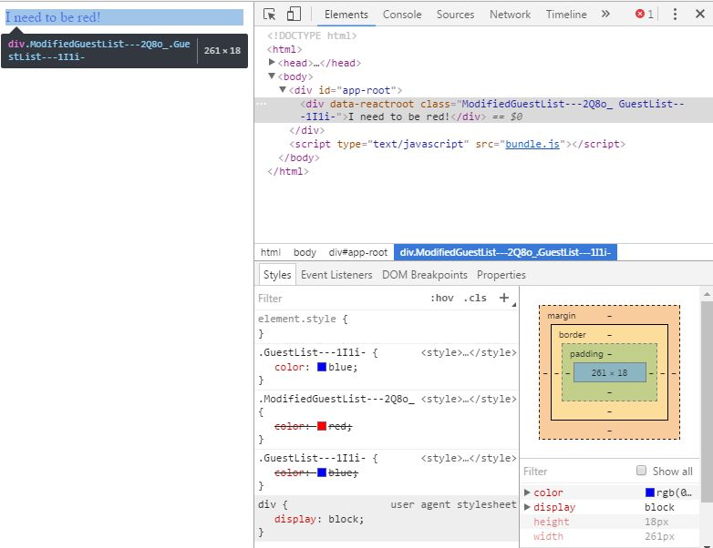

# css-modules-test
Demostration for css-modules potential bug.
Style tag is injected twice for the same class.
Using Webpack 2.2.

* npm install
* npm run dev-server

Check out the style tags in the html: there are 2 tags for class GuestList.

## demo

